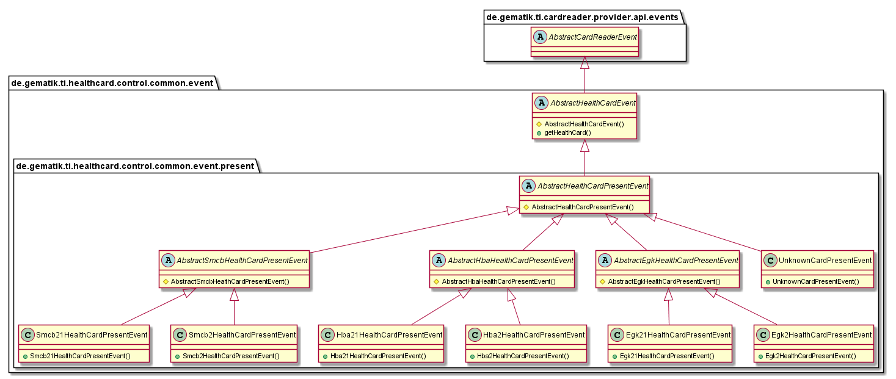

# HealthCardControlCommon Java Library

TODO

## API Documentation

Generated API docs are available at <https://gematik.github.io/ref-HealthCardControlCommon>.

## License

Licensed under the [Apache License, Version 2.0](https://www.apache.org/licenses/LICENSE-2.0).

## Overview

This library contains the `CardDetector`, the `TrustedChannelPaceKeyRequestHandler`, and the `PinVerifier`.

The CardDetector automatically determines the current card type and the current card generation and provides information about card events.

For each PaceKeyRequest event starts the TrustedChannelPaceKeyRequestHandler thread in this instance in order to request the CardAccessNumber via an event bus request from the user interface or another application.
After the CardAccessNumber response, the PaceKey negotiation is started, and after the successful negotiation, the requester is informed of the Pacekey.

The Events send over EventBus are stored in package `de.gematik.ti.healthcard.control.events` and subpackages.

  

### CardDetector

#### Purpose

The singleton Card Detector subscribe to EventBus for Card- and CardReader-Events.
For each CardPresent-Event determine this class automatically the Card Type (e.g. EGK, HBA or SMCB) and the Card Generation (e.g. G2, G2.1).
With this information would the `HealtCard` object initialized and the EventBus subscriber informed with HealthCardPresentEvents for the specific type.
Furthermore the CardDetector send an event for each absent card or disconnected card reader with containing health card.

  

### HealthCardPresentEvents

The control layer send specific events for each present health card or if the type is unknown an UnknownCardPresentEvent.
The subscriber could subscribe for specific HealthCardPresentEvent e.g. Egk21HealthCardPresentEvent or for generally events like AbstractEgkHealthCardPresentEvent for all EGK present events.

  

### HealthCardAbsentEvents

The control layer send specific events for each absent health card or for disconnected card reader with containing health card.
The subscriber could subscribe for specific HealthCardAbsentEvent e.g. Egk21HealthCardAbsentEvent or for generally events like AbstractEgkHealthCardAbsentEvent for all EGK absent events.

**HealthCardAbsentEvents.**

    @startuml

        package de.gematik.ti.healthcard.control.common.common.event {
          package de.gematik.ti.healthcard.control.common.event.absent {
            abstract class AbstractEgkHealthCardAbsentEvent {
                # AbstractEgkHealthCardAbsentEvent()
            }
          }
        }

        package de.gematik.ti.healthcard.control.common.event {
          package de.gematik.ti.healthcard.control.common.event.absent {
            abstract class AbstractHbaHealthCardAbsentEvent {
                # AbstractHbaHealthCardAbsentEvent()
            }
          }
        }

        package de.gematik.ti.healthcard.control.common.event {
          package de.gematik.ti.healthcard.control.common.event.absent {
            abstract class AbstractHealthCardAbsentEvent {
                # AbstractHealthCardAbsentEvent()
            }
          }
        }

        package de.gematik.ti.healthcard.control.common.event {
          package de.gematik.ti.healthcard.control.common.event.absent {
            abstract class AbstractSmcbHealthCardAbsentEvent {
                # AbstractSmcbHealthCardAbsentEvent()
            }
          }
        }

        package de.gematik.ti.healthcard.control.common.event {
          package de.gematik.ti.healthcard.control.common.event.absent {
            class Egk21HealthCardAbsentEvent {
                + Egk21HealthCardAbsentEvent()
            }
          }
        }

        package de.gematik.ti.healthcard.control.common.event {
          package de.gematik.ti.healthcard.control.common.event.absent {
            class Egk2HealthCardAbsentEvent {
                + Egk2HealthCardAbsentEvent()
            }
          }
        }

        package de.gematik.ti.healthcard.control.common.event {
          package de.gematik.ti.healthcard.control.common.event.absent {
            class Hba21HealthCardAbsentEvent {
                + Hba21HealthCardAbsentEvent()
            }
          }
        }

        package de.gematik.ti.healthcard.control.common.event {
          package de.gematik.ti.healthcard.control.common.event.absent {
            class Hba2HealthCardAbsentEvent {
                + Hba2HealthCardAbsentEvent()
            }
          }
        }

        package de.gematik.ti.healthcard.control.common.event {
          package de.gematik.ti.healthcard.control.common.event.absent {
            class Smcb21HealthCardAbsentEvent {
                + Smcb21HealthCardAbsentEvent()
            }
          }
        }

        package de.gematik.ti.healthcard.control.common.event {
          package de.gematik.ti.healthcard.control.common.event.absent {
            class Smcb2HealthCardAbsentEvent {
                + Smcb2HealthCardAbsentEvent()
            }
          }
        }

        package de.gematik.ti.healthcard.control.common.event {
          package de.gematik.ti.healthcard.control.common.event.absent {
            class UnknownCardAbsentEvent {
                + UnknownCardAbsentEvent()
            }
          }
        }

          package de.gematik.ti.healthcard.control.common.event {
            abstract class AbstractHealthCardEvent {
                # AbstractHealthCardEvent()
                + getHealthCard()
            }
          }

      package de.gematik.ti.cardreader.provider.api.events {
        abstract class AbstractCardReaderEvent {
        }
      }

      AbstractHealthCardEvent -up-|> AbstractCardReaderEvent
      AbstractEgkHealthCardAbsentEvent -up-|> AbstractHealthCardAbsentEvent
      AbstractHbaHealthCardAbsentEvent -up-|> AbstractHealthCardAbsentEvent
      AbstractHealthCardAbsentEvent -up-|> AbstractHealthCardEvent
      AbstractSmcbHealthCardAbsentEvent -up-|> AbstractHealthCardAbsentEvent
      Egk21HealthCardAbsentEvent -up-|> AbstractEgkHealthCardAbsentEvent
      Egk2HealthCardAbsentEvent -up-|> AbstractEgkHealthCardAbsentEvent
      Hba21HealthCardAbsentEvent -up-|> AbstractHbaHealthCardAbsentEvent
      Hba2HealthCardAbsentEvent -up-|> AbstractHbaHealthCardAbsentEvent
      Smcb21HealthCardAbsentEvent -up-|> AbstractSmcbHealthCardAbsentEvent
      Smcb2HealthCardAbsentEvent -up-|> AbstractSmcbHealthCardAbsentEvent
      UnknownCardAbsentEvent -up-|> AbstractHealthCardAbsentEvent

    @enduml

### TrustedChannelPaceKeyRequestHandler

The singleton TrustedChannelPaceKeyRequestHandler subscribe to EventBus for PaceKey-Request-Events.
For each PaceKeyRequest-Event start this instance a thread to request the CardAccessNumber over Event-Bus request from UI or other application.
After CardAccessNumber response starts the PaceKey negotiation and after success negotiation would the requester informed about the pacekey.

  

### CallBackHandlePin

If PIN entries are necessary for the card, these are controlled by the class CallBackHandlePin.
The process prompts for the PIN reference - regardless of whether the PIN was previously successfully entered and checked.
The card reader transmits the PIN to the selected card for verification.
The test result provides information about the success or failure of the PIN check and, if applicable, the number of remaining PIN attempts.

  

### Getting Started

#### Build setup

To use HealthCardControlCommon library in a project, you need just to include following dependency:

**Gradle dependency settings to use HealthCardCommon library.**

    dependencies {
        implementation group: 'de.gematik.ti', name: 'healthcard.control.common', version: '1.0.0'
    }

**Maven dependency settings to use HealthCardControlCommon library.**

    <dependencies>
        <dependency>
            <groupId>de.gematik.ti</groupId>
            <artifactId>healthcard.control.common</artifactId>
            <version>1.0.0</version>
        </dependency>
    </dependencies>
